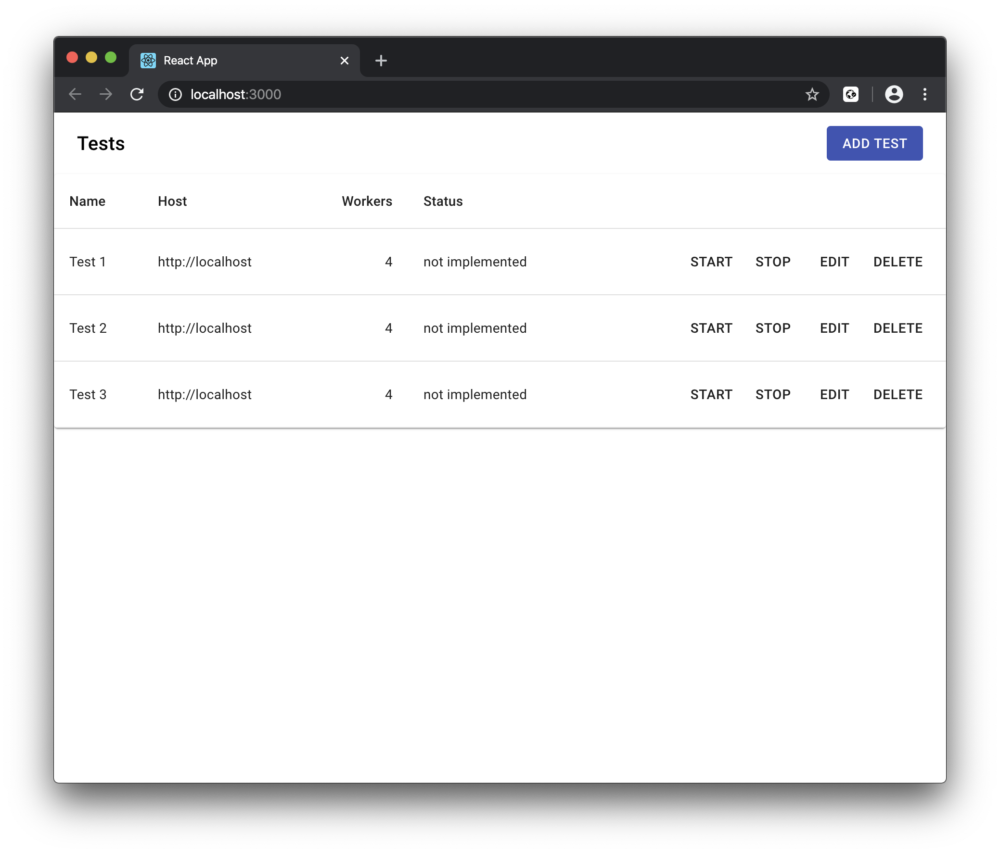
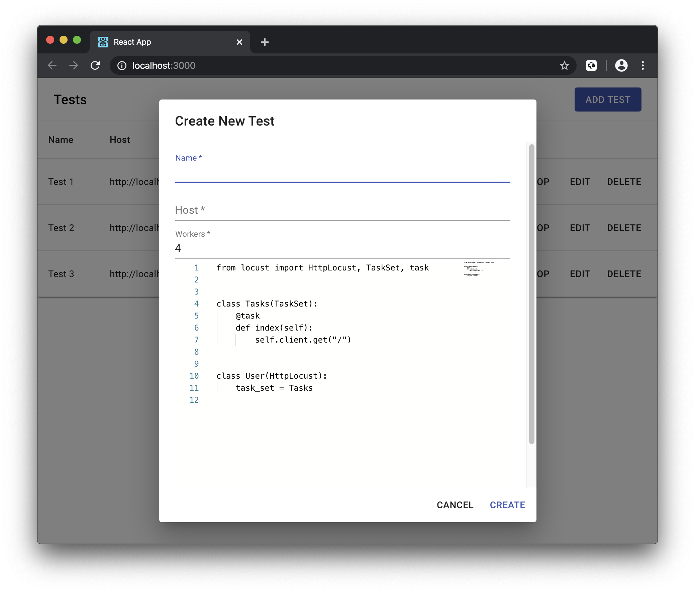
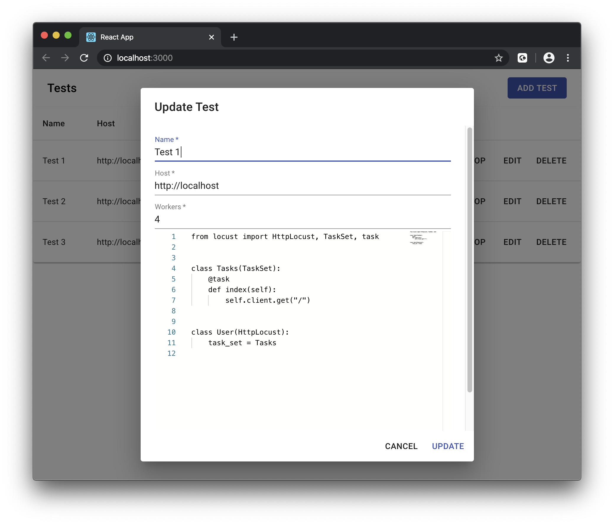

# Locust Server

Locust Server allows you to start multiple Locust clusters with provided configurations and tasks files.

### Development

#### Prerequisites

* Python 3
* Node JS
* `yarn`
* `kubectl`
* `helm`, tested with version 3 only, don't know whether it works with version 2


#### Install dependencies

For Python dependencies it's recommended to create a virtual environment to install them into first, which can be done with the following command:

```bash
# Create virtual environment
python3 -m venv /path/to/new/virtual/environment

# Activate virtual environment
source /path/to/new/virtual/environment/bin/activate
``` 

Now you can install dependencies with this command:

```bash
make init
```

#### Start server

```bash
make start-server
```

#### Start client

```bash
make start-client
```

#### Building Docker image and running container

```bash
docker build -t locust-server .
docker run --rm -p 3001:8000 -v ${HOME}/.kube:/root/.kube -it locust-server
```

### Screenshots



