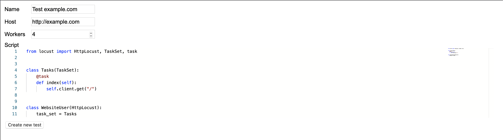

# Locust Server

Locust Server allows you to start multiple Locust clusters with provided configurations and tasks files.



### Requirements

* Python 3
* `kubectl`
* `helm`, tested with version 3 only, don't know whether it works with version 2

### Running

```bash
# Install requirements globally or in virtual environment
pip install -f requirements.txt

# Start server 
uvicorn main:app
```

Then go to http://localhost:8000 and submit tests